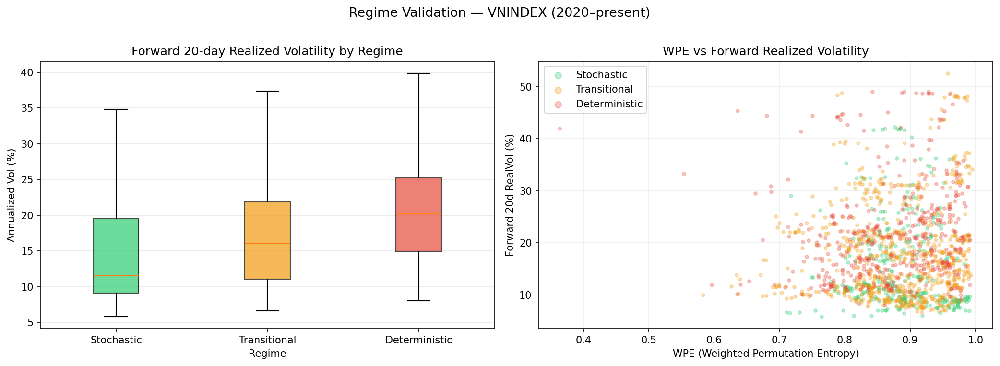
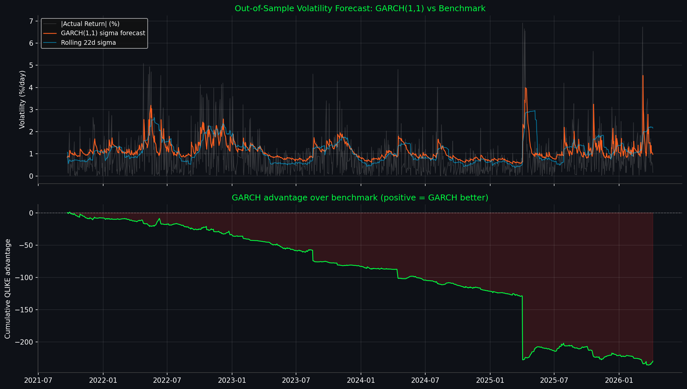

# Financial Entropy Agent

**An entropy-based market risk surveillance system that uses Information Theory and Statistical Physics to detect structural risk invisible to traditional volatility measures.**

Built by a former securities broker who studied physics — motivated by the observation that financial markets exhibit Type-2 chaos, where dangerous coordination (herding, panic) produces deterministic structure that entropy can detect.



---

## The Problem

Traditional risk management relies on volatility — the standard deviation of past returns. This approach has a fundamental blind spot: **volatility is backward-looking**. It tells you the market *was* risky, not that it *is becoming* risky. Before every major crash, rolling volatility is low because the market appears calm.

As a securities broker observing the Vietnamese stock market (VNINDEX), I noticed a pattern: the most dangerous periods weren't when the market was visibly chaotic, but when price movements became unusually *structured* — when everyone was buying the same stocks, following the same momentum, creating an illusion of stability that masked fragility underneath.

This led to a hypothesis rooted in my physics background: **if financial markets are Type-2 chaotic systems, then entropy — the measure of disorder — should detect structural risk before volatility does.**

---

## The Approach

The system measures market disorder through three entropy metrics, classifies structural regimes using unsupervised learning, and estimates conditional volatility via GARCH modeling.

### Entropy Feature Engineering

**Weighted Permutation Entropy (WPE)** measures the ordinal pattern disorder in price log-returns. Low WPE means price movements follow deterministic, repeating patterns — the signature of coordinated behavior (herding, panic, momentum). High WPE means random, unpredictable movements — a normal, healthy market.

**Standardized Price Sample Entropy (SPE_Z)** measures trajectory complexity of close prices. It captures how predictable the price path is in amplitude space, complementing WPE's ordinal analysis.

**Volume Entropy (Shannon + SampEn)** measures liquidity structure — whether capital flow is concentrated (institutional consensus) or dispersed (fragmented, no agreement).

### Regime Classification (GMM)

A Full-Covariance Gaussian Mixture Model (n=3) operates directly on raw [WPE, SPE_Z] features — no preprocessing or normalization — discovering the natural topological boundaries of three market phases:

- **Deterministic** (low entropy) — Strong ordinal structure in price movements. Indicates trending, coordinated behavior. *Highest risk.*
- **Transitional** (mid entropy) — Phase boundary between ordered and disordered states. *Moderate risk.*
- **Stochastic** (high entropy) — Random walk behavior. Normal, healthy market. *Lowest risk.*

### Conditional Volatility (GARCH)

GARCH(1,1) provides the conditional volatility backbone, with entropy features tested as exogenous variables (GARCH-X). Filtered Historical Simulation computes Expected Shortfall (ES 5%) without assuming Gaussian tails.

### AI Explanation Layer

An LLM agent (Claude API) translates quantitative signals into natural-language risk narratives for non-technical investors — the "last mile" between mathematical models and actionable advice.

For the full mathematical formulations (WPE, SampEn, Yeo-Johnson, GMM specifications, GARCH variance equations), see [ARCHITECTURE.md](ARCHITECTURE.md).

---

## Validation Results

All validation is out-of-sample on VNINDEX data (2020–2026, ~1,600 trading days). Code is in the `validation/` folder and fully reproducible.

### V1: Regime Labels Discriminate Future Volatility

Entropy-based regime labels significantly predict forward 20-day realized volatility.

| Regime | Mean Forward 20d Vol | Median | n |
|:-------|:---------------------|:-------|:--|
| **Deterministic** (High Risk) | 21.59% | 20.23% | 464 |
| Transitional | 18.00% | 16.11% | 754 |
| **Stochastic** (Low Risk) | 15.15% | 11.54% | 340 |

**Kruskal-Wallis H = 150.89, p < 0.0001** — Regime labels carry statistically significant information about future market risk.

### V3: Tail Risk Detection — Where Entropy Excels

The system's discriminative power *increases with event severity* — precisely the behavior required for tail risk management.

| Timeframe | Drawdown | Stochastic | Deterministic | Lift |
|:----------|:---------|:-----------|:--------------|:-----|
| 5 days | > 3% | 8.5% | 17.4% | **2.06×** |
| 5 days | > 7% | 0.8% | 4.3% | **5.50×** |
| 10 days | > 5% | 6.3% | 16.0% | **2.54×** |
| 20 days | > 7% | 6.5% | 19.6% | **3.00×** |

When the system identifies a Deterministic regime, the probability of a severe drawdown (>7% in 5 days) is **5.5 times higher** than during Stochastic regimes. For a risk manager, this is actionable information for position sizing.


### V4: Entropy vs Simple Volatility — Complementary, Not Replacement

| Model | Features | H-statistic | p-value |
|:------|:---------|:------------|:--------|
| A: Entropy | WPE, SPE_Z | 150.55 | < 0.0001 |
| B: Simple Vol | Rolling 22d vol, 5d vol change | 299.78 | < 0.0001 |
| C: Combined | WPE, SPE_Z, Rolling 22d vol | 229.04 | < 0.0001 |

Simple volatility discriminates future volatility better (H=299.78 vs 150.55) — this is expected because past volatility auto-correlates with future volatility. **However, entropy measures a different dimension of risk: structural fragility.** Entropy detects FOMO peaks, herding behavior, and momentum concentration *before* they manifest as volatility spikes. The Combined model (H=229.04) confirms entropy carries complementary information beyond what simple volatility provides.


### V2: GARCH Forecast Evaluation — Honest Limitations

| Metric | GARCH(1,1) | Rolling 22d | Winner |
|:-------|:-----------|:------------|:-------|
| QLIKE | 1.7765 | 1.5737 | Rolling 22d |
| MSE Variance | 15.5130 | 15.3941 | Rolling 22d |
| Correlation(σ, \|r\|) | 0.3302 | — | — |

GARCH(1,1) underperforms simple rolling volatility on point forecast metrics for VNINDEX. This is consistent with frontier market characteristics — VNINDEX exhibits jump risk (circuit breakers, policy shocks) that GARCH's smooth conditional variance cannot capture. The positive directional correlation (r=0.33) confirms the model tracks volatility direction correctly but misestimates magnitude.

This result justifies the system's use of Filtered Historical Simulation rather than parametric VaR — FHS does not assume Gaussian tails and is more robust to the fat-tailed distribution of VNINDEX returns.



---

## Key Insight: The Entropy Paradox

The most important finding from validation was counterintuitive: **in financial markets, low entropy = high risk, and high entropy = low risk.**

This is the *opposite* of physical systems, where low entropy indicates calm equilibrium. In financial markets — which are Type-2 chaotic systems with reflexive, adversarial participants — low entropy means price movements have become deterministic. Deterministic structure in financial prices is not a sign of health; it is the signature of **coordinated behavior**: herding, panic selling, or momentum-driven rallies. These states are inherently unstable and produce the largest realized moves.

Maximum entropy, by contrast, means maximum randomness — a market where diverse participants with diverse strategies cancel each other out. This is the *healthy* state.

**Entropy does not measure volatility. It measures the absence of dangerous coordination.**

This insight directly connects to the Type-2 chaos hypothesis that motivated the project: in a system where participants observe and react to each other (reflexivity), order is a warning signal.

---

## Lessons Learned

**1. Validation changes everything.** The initial regime labels were inverted (mislabeled "Stable" for the highest-risk regime). Without forward-looking validation, this error would have gone undetected and the system would have given exactly wrong advice. Lesson: never trust model outputs without out-of-sample evidence.

**2. Complexity must justify itself.** GARCH-X with entropy exogenous variables was statistically insignificant during calm periods — entropy adds no value to volatility forecasting when the market is already stable. The system needed to be redesigned with adaptive activation: entropy contributes through regime classification (always active) rather than forcing it into the variance equation.

**3. Simple benchmarks are essential.** Rolling 22-day volatility outperformed GARCH on VNINDEX. This doesn't invalidate the entropy approach — it clarifies its role: entropy excels at structural risk detection (Lift 5.5× for tail events), while simple volatility excels at point forecasting. They solve different problems.

**4. Domain knowledge matters more than model sophistication.** The Entropy Paradox was only interpretable because of my background in physics (understanding entropy in different system types) and finance (understanding that coordinated behavior drives crashes). A purely technical approach would have either missed the inversion or abandoned entropy as "broken."

---

## Architecture Overview

```
                        FINANCIAL ENTROPY AGENT
                    =======================================

                    [ RAW OHLCV & VN30 DATA ]
                               |
              +----------------+----------------+
              |                                 |
   [ ENTROPY FEATURE ENGINE ]      [ GARCH VOLATILITY ENGINE ]
   WPE, SPE_Z, Vol_Shannon,       GARCH(1,1) + FHS
   Vol_SampEn                      -> sigma_t, VaR 5%, ES 5%
              |                                 |
   [ GMM REGIME CLASSIFIER ]                   |
   Deterministic / Transitional                 |
   / Stochastic (no preprocessing)              |
              |                                 |
              +----------------+----------------+
                               |
                   [ REGIME x VOLATILITY ]
                   sigma_adjusted = sigma_t x regime_multiplier
                               |
                   [ AI EXPLANATION LAYER ]
                   Claude API -> Natural language
                   risk narrative
                               |
                   [ STREAMLIT DASHBOARD ]
                   Interactive terminal
```

For detailed mathematical specifications, see [ARCHITECTURE.md](ARCHITECTURE.md).

---

## Project Structure

```
Financial Entropy Agent/
├── agent_orchestrator.py       # GARCH engine, risk scoring, AI agent orchestrator
├── dashboard.py                # Streamlit interactive terminal
├── skills/
│   ├── data_skill.py           # Data ingestion (vnstock, yfinance)
│   ├── quant_skill.py          # WPE, SampEn, Shannon, kinematics
│   └── ds_skill.py             # GMM regime classification
├── validation/
│   ├── regime_validation.py    # V1: Regime labels vs forward realized vol
│   ├── garch_forecast_eval.py  # V2: GARCH out-of-sample forecast
│   ├── risk_alert_hitrate.py   # V3: Drawdown prediction hit rate
│   └── entropy_vs_simple.py    # V4: Entropy vs simple vol comparison
├── ARCHITECTURE.md             # Full mathematical specifications
├── requirements.txt
└── README.md                   # This file
```

---

## Getting Started

### Prerequisites

- Python 3.9+
- An Anthropic API key (for the AI agent; optional — system works without it)

### Installation

```bash
git clone https://github.com/223hoangthai35/financial-entropy-agent.git
cd financial-entropy-agent
pip install -r requirements.txt
```

### Run the Dashboard

```bash
streamlit run dashboard.py
```

### Run Validation Suite

```bash
python validation/regime_validation.py
python validation/risk_alert_hitrate.py
python validation/entropy_vs_simple.py
python validation/garch_forecast_eval.py
```

---

## Technical Requirements

`numpy`, `pandas`, `numba` (JIT), `scikit-learn` (GMM), `scipy`, `arch` (GARCH), `statsmodels`, `plotly`, `streamlit`, `anthropic` (optional), `matplotlib`, `vnstock`, `yfinance`

---

## References

- Bandt, C. & Pompe, B. (2002). *Permutation Entropy: A Natural Complexity Measure for Time Series.* Physical Review Letters, 88(17).
- Fadlallah, B. et al. (2013). *Weighted-Permutation Entropy: A Complexity Measure for Time Series Incorporating Amplitude Information.* Physical Review E, 87(2).
- Richman, J.S. & Moorman, J.R. (2000). *Physiological Time-Series Analysis Using Approximate Entropy and Sample Entropy.* American Journal of Physiology.
- Bollerslev, T. (1986). *Generalized Autoregressive Conditional Heteroskedasticity.* Journal of Econometrics.

---

## About the Author

Physics background -> Securities broker -> Data Science.

This project was born from observing that traditional technical analysis systematically failed to warn about structural market risks. The hypothesis — that entropy from statistical physics could detect dangerous coordination in financial markets — was validated through rigorous out-of-sample testing on 6 years of VNINDEX data.

---

*Disclaimer: This system is a quantitative research tool for structural risk assessment. It is not investment advice. All investment decisions require final approval from qualified professionals.*
