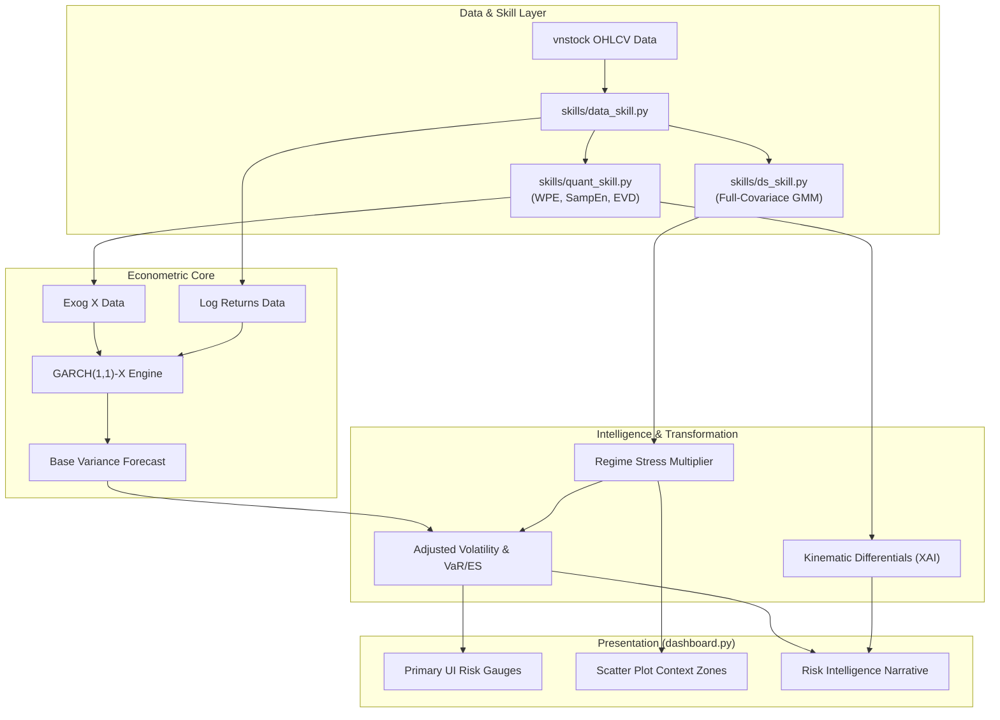

# ARCHITECTURE.md

## Financial Entropy Agent -- Technical Architecture Specification

**Version**: 6.0 (Regime-Aware Verdict Matrix + Direction-Aware XAI Narrative)
**Classification**: Entropy-Driven Conditional Volatility Engine & Diagnostic XAI Terminal

---

## 1. System Philosophy: From Numbers to Narratives

The system has evolved from a purely quantitative 0-100 composite risk scoring engine into a comprehensive **Explainable AI (XAI) Risk Terminal**. The core architectural pivot is the realization that raw entropy indices are more valuable when used as **exogenous predictors for volatility** and as triggers for **linguistic synthesis**, rather than being arbitrarily summed into gauge charts.

The primary risk pipeline is:
1. **Entropy Feature Engineering** → GMM Regime Classification (structural state)
2. **GARCH(1,1)-X Engine** → Conditional volatility σ_t with entropy exogenous variables
3. **Regime Multiplier** → σ_adjusted = σ_raw × regime_multiplier (1.0x / 1.4x / 2.2x)
4. **Verdict Matrix** → Risk label derived from σ_adjusted × regime combination, preventing σ threshold alone from mislabeling liquidity spikes as systemic crises
5. **Intelligence Report** → Direction-aware XAI narrative: Deterministic + rally vs. Deterministic + decline produce different interpretations

---

## 2. Structural Layering

The codebase separates concerns into strictly parallel pipelines.

### Layer A: Unsupervised Phase Space (GMM Diagnostics)

This layer runs independently for **Plane 1 (Price)** and **Plane 2 (Liquidity)**, applying Gaussian Mixture Models to categorize the current environment with zero human thresholding.

#### A.1 Price Plane (Plane 1)
- **Features Input**:
  - $X$: `WPE` (Weighted Permutation Entropy)
  - $Y$: `SPE_Z` (Standardized Price Sample Entropy)
- **Classification Method**: Full-Covariance GMM ($k=3$) with absolutely **no PowerTransformer** normalizations. Raw topology is preserved by design.
- **Identified Regimes**: Deterministic, Transitional, Stochastic.
  - Deterministic (low entropy) — highest structural risk, coordinated behavior
  - Transitional (mid entropy) — phase boundary, moderate risk
  - Stochastic (high entropy) — random walk, normal healthy market

#### A.2 Liquidity Plane (Plane 2)
- **Features Input**:
  - $X$: `Vol_Shannon` (Volume Concentration)
  - $Y$: `Vol_SampEn` (Volume Complexity)
- **Classification Method**: Full-Covariance GMM ($k=3$) with Yeo-Johnson PowerTransformer preprocessing.
- **Identified Regimes**: Consensus Flow, Dispersed Flow, Erratic/Noisy Flow.

### Layer B: Cross-Sectional Breadth (Supplementary)

Operates strictly behind-the-scenes on VN30 index components.
- Extracts the **Eigenvalue Decomposition** of the 22-day rolling Pearson correlation matrix.
- Yields the Cross-Sectional Entropy ($S_{corr}$), quantifying whether the market is heavily glued together (High Risk of flash crash) or healthily fragmented.

---

## 3. The Quantitative Engine (GARCH-X)

Rather than the legacy system's min-max scaling combinations to compute risk mathematically, **Version 5.0 implements a unified Econometric Volatility Model**. 

### The Core Loop
```python
# Model initialization using the Python `arch` library 
# exog_vars = [H_price(WPE + |SPE_Z|), H_volume(Vol_SampEn + Vol_Shannon)]
# Both normalized via rolling 504-day MinMaxScaler, lagged 1 day (no look-ahead)
am = arch_model(y, x=exog_vars, vol='GARCH', p=1, q=1, dist='Normal')
res = am.fit(disp='off', options={'maxiter': 500})
```

Statistical pruning: exogenous variables with p-value > 0.10 are dropped. If both are insignificant, the model falls back to pure GARCH(1,1) — entropy features are still used for regime classification but do not enter the variance equation.

The system forecasts out-of-sample volatility ($\sigma_t$). However, to reflect structural market vulnerabilities detected by the GMM Phase Spaces, the agent applies the **Regime Stress Multiplier Protocol**.

1. Extract `current_regime` and `current_vol_regime`.
2. Map to empirically determined stress amplifiers (calibrated on VNINDEX forward volatility):
   - Stochastic: 1.0x — normal market, no structural stress premium
   - Transitional: 1.4x — mixed structure, phase transition in progress
   - Deterministic: 2.2x — high coordination, structural fragility at maximum
3. Output **Adjusted Volatility** = Base $\sigma_t \times \text{Multiplier}$.

This Adjusted Volatility drives the primary risk gauge in the UI.

---

## 4. The XAI Linguistic Generator (Risk Intelligence Report)

The visual output replaces massive data tables with the **Risk Intelligence Report**. 
The system algorithmically parses the underlying outputs over four blocks:

1. **Volatility Assessment**: Interprets the raw statistical significance (p-values) of the Entropy vectors within the GARCH-X regression. If $p > 0.05$, the XAI informs the user that Entropy is acting purely as a regime classifier rather than a daily variance cluster predictor.
2. **Phase Space Diagnostics**: Synthesizes the Regime labels from Layer A. Direction-aware: Deterministic + rising prices (coordinated rally, late-stage momentum warning) produces a different narrative from Deterministic + falling prices (institutional selling or panic). Emits a **Divergence Alert** if Price shows "Stochastic" but liquidity shows "Erratic" (Capitulation Vacuum), or if Price shows "Deterministic" but volume shows "Dispersed" (Hollow Rally / Bull Trap).
3. **Kinematic Momentum**: Evaluates the velocity ($V_{WPE}$) and acceleration ($a_{WPE}$) using basic differential logic to explain the trajectory of market disorder.
4. **Tail Risk Observer**: Generates the Expected Shortfall ($ES_{5\%}$) narrative, modified by the Cross-Sectional ratio (Vector 3) to articulate if distribution tails are expanding or contracting.

---

## 5. Execution Pipeline



---

## 6. Verdict Matrix (Regime-Aware Risk Classification)

The Verdict Matrix replaces hard σ thresholds as the final risk label output. It combines `sigma_adjusted` level with the current price regime in a 3×4 grid:

| | Stochastic | Transitional | Deterministic |
|:---|:---|:---|:---|
| σ < 0.8% | LOW RISK 🟢 | STRUCTURAL BUILD-UP 🟡 | STRUCTURAL WARNING 🟠 |
| σ 0.8–1.5% | LOW-MODERATE 🟢 | MODERATE RISK 🟡 | STRUCTURAL WARNING 🟠 |
| σ 1.5–2.5% | ELEVATED VOLATILITY 🟡 | HIGH RISK 🟠 | HIGH RISK 🟠 |
| σ > 2.5% | ELEVATED VOLATILITY 🟡 | HIGH RISK 🟠 | EXTREME RISK 🔴 |

**Key insight**: A σ > 2.5% in a Stochastic regime is labeled ELEVATED VOLATILITY (yellow), not EXTREME RISK (red). The structural source matters — a liquidity-driven spike in a healthy market is categorically different from the same σ level arising from Deterministic coordination.

The **STRUCTURAL WARNING** cell (Deterministic + low σ) is the classic calm-before-storm pattern: entropy detects coordination building while volatility appears low, providing advance warning before σ spikes.

---

## 7. Architecture Decisions & Deprecations

### Active Fallback (not deprecated)
- **`calc_composite_risk_score()`**: The entropy aggregate (0-100 score) remains as a fallback when GARCH-X is unavailable (< 120 days of data). It is not shown in the primary pipeline but is invoked automatically in dashboard when `fit_garch_x()` returns an error.

### Deprecated
- **Tri-Vector weighted sum as primary risk metric**: Fixed weights (V1 40% / V2 40% / V3 20%) with P75/P90 dynamic thresholds are superseded by GARCH σ_t + Regime Multiplier + Verdict Matrix. The GARCH framework captures volatility clustering and entropy's contribution to variance in a statistically rigorous way that arbitrary weighting cannot.
- **5-day Pattern Fingerprinting**: Short-horizon pattern matching has been removed. Structural regime classification operates on 22-day (WPE) and 60-day (SampEn) rolling windows — timescales validated against forward realized volatility.
- **PowerTransformer on Plane 1**: No normalization is applied to [WPE, SPE_Z] before GMM. Preserves the natural topology of entropy distributions — the raw scale carries physical meaning. PowerTransformer is retained for Plane 2 (Volume) only.
- **Static risk threshold labels**: Hard thresholds on σ alone (e.g., >2.5% = EXTREME RISK) are replaced by the Verdict Matrix, which contextualizes σ_adjusted against the current price regime. A σ > 2.5% in a Stochastic regime (healthy structure) produces a different label than the same σ in a Deterministic regime (structural coordination).
